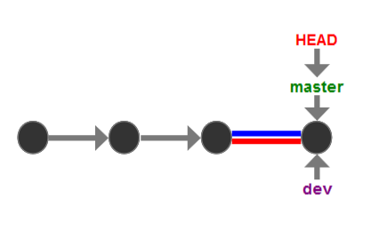

##### 为什么学Git?
- 1 工欲善其事，必先利其器
- 2 Def：`distributed` Version Control System(VCS) for tracking changes in computer files
- 3 His:　
    &nbsp;&nbsp;&nbsp;Linus->Linux (1991)：diff+Linus手工合并代码:CVS\SVN集中式速度慢,商用版不符合开源精神
    &nbsp;&nbsp;&nbsp;2002：BitKeeper(BitMover)授权Linux社区免费使用
    &nbsp;&nbsp;&nbsp;2005：Andrew(Samba开发者)试图破解BitKeeper协议，收回。
    &nbsp;&nbsp;&nbsp;Linus->Git(by C) in two weeks
    &nbsp;&nbsp;&nbsp;2008:GitHub


##### Install 
- 1 win: https://git-scm.com/download/win

##### Basic commands
```
$ git init   // initialize Local Git Repository 
$ git add<file>  // Add File(s) To Index
$ git status  // Check Status of Working Tree
$ git commit  // Commit Changes In Index
$ git push   //Push to Remote Repository
$ git pull    //Pull Latest From Remote Repository
$ git clone  //clone Repository into a new Directory
```
<!-- more -->

##### Use
###### 1.init 
- 1 Def repository:一个可以被Git管理、追踪(`Changes`文件的修改、删除、添加)的仓库，以便将来可以“还原”。
- 2 Use:
    ```
    $ mkdir myres //创建文件目录
    $ cd myres  //进入文件夹
    $ git init  //初始化仓库(将文件夹转为Git仓库)
    Initialized empty Git repository in ../myres/.git
    ```

###### 2.add与commit 
- 1 Def 
    **add**: 将工作区文件添加到暂存区(Index/stage)
    **commit**: 提交添加(将文件从暂存区stage提交到版本库)
    **rm**: 删除文件

- 2 Use:
    新建一个readme.md文件
    ```
    $ git add readme.md // 添加文件到暂存区stage，*表示all
    $ git commit -m "add readme" // -m:message， 提交到res
    [master (root-commit) 99ae527] add readme
    1 file changed, 0 insertions(+), 0 deletions(-)
    create mode 100644 readme.md
    ```
    `file changed` 文件改动 `insertions`插入行数 `deletions`删除行数

###### 3.status与diff 
- 1 Def
    **status**: 查看仓库当前状态
    **diff**: 比较修改内容[diff要在add之前使用]
    **checkout - -与reset HEAD**： 抛弃修改与撤销缓存(回到当前版本)
- 2 Use
    修改readme.md，加入:
        Git is a distributed version control system
    **2.1.直接查看**
    ```
    $ git status
    On branch master
    Changes not staged for commit:
        (use "git add <file>..." to update what will be committed)
        (use "git checkout -- <file>..." to discard changes in working directory)

        modified:   readme.md

    no changes added to commit (use "git add" and/or "git commit -a")
    ```
    readme被修改，但是还没有添加到暂存区准备提交。你可添加add到暂存区，同时也可以`checkout --` 抛弃修改。

    **2.2.检查修改内容**
    ```
    $ git diff readme.md
    diff --git a/readme.md b/readme.md
    index e69de29..45e43ab 100644
    --- a/readme.md
    +++ b/readme.md
    @@ -0,0 +1 @@
    +Git is a distributed version control system
    \ No newline at end of file
    ```

    **2.3.add并查看**
    ```
    $ git add *
    $ git status
    On branch master
    Changes to be committed:
        (use "git reset HEAD <file>..." to unstage)

        modified:   readme.md
    ```
    status表示 要被提交的修改有 readme.md，同时你也可以用`reset HEAD `取消暂存。

    **2.4.commit并查看**
    ```
    $ git commit -m "add distributed"
    [master 51e675a] add distributed
    1 file changed, 1 insertion(+)
    $ git status
    On branch master
    nothing to commit, working tree clean
    ```
    status表示 没有需要提交的修改，工作目录是干净（working tree clean）的。

###### 4.log、reset与reflog
- 1 Def:
    **log**: 显示从最近到最远的提交日志
    **reset**: 重置(回退)版本
    **reflog**: 显示命令日志
- 2 Use:
    情景：三个版本
    版本1：add distributed
    ```
    Git is a distributed version control system.
    ```
    版本2：add free
    ```
    Git is a distributed version control system.
    Git is free softwave.
    ```
    版本3：append GPL
    ```
    Git is a distributed version control system.
    Git is free softwave distributed under the GPL. 
    ```

    **2.1.查看提交日志**
    ```
    $ git log
    commit 092719a05ea5929fb2a72c990ae3a38a5b0b8129 (HEAD -> master)
    Author: alazia <alazia@email.com>
    Date:   Sun Aug 4 17:54:32 2019 +0800

        append GPL

    commit 8a74499d95b927245debf21afadf001e621cb948
    Author: alazia <alazia@email.com>
    Date:   Sun Aug 4 17:53:14 2019 +0800

        add free

    commit 51e675ad6e4a906bd4de3c65ef830b9564864ca4
    Author: alazia <alazia@email.com>
    Date:   Sun Aug 4 17:39:11 2019 +0800

        add distributed
    ```
    通过log 我们可以看到3次提交，最近的一次是append GPL，上一次是add free，最早的一次是add distributed

    <i>简洁化查看提交日志 - -pretty=oneline</i>
    ```
    $ git log --pretty=oneline
    092719a05ea5929fb2a72c990ae3a38a5b0b8129 (HEAD -> master) append GPL
    8a74499d95b927245debf21afadf001e621cb948 add free
    51e675ad6e4a906bd4de3c65ef830b9564864ca4 add distributed
    ```
    为了解决多人协作版本冲突问题，git采用了SHA1计算出的数字十六进制来表示版本号`commit id`
    
    <span id="001"></span>
    **2.2.版本回退**
    HEAD 表示当前版本，HEAD^表示上一个版本，上N个版本用HEAD~N表示。
    现在要从当前版本append GPL 回退到上一个版本 add free
    ```
    $ git reset --hard HEAD^ //使用commit id也可以
    HEAD is now at 8a74499 add free

    $ cat readme.md
    Git is a distributed version control system.
    Git is free softwave
    ```
    **2.3.回到未来**
    当经过上一步版本回退后，查看提交日志时，你会发现新的版本已经消失：
    ```
    $ git log
    commit 8a74499d95b927245debf21afadf001e621cb948 (HEAD -> master)
    Author: alazia <alazia@email.com>
    Date:   Sun Aug 4 17:53:14 2019 +0800

        add free

    commit 51e675ad6e4a906bd4de3c65ef830b9564864ca4
    Author: alazia <alazia@email.com>
    Date:   Sun Aug 4 17:39:11 2019 +0800

        add distributed

    commit 99ae527b16c7a4fe17c77f383b4bdba54a5f5ceb
    Author: alazia <alazia@email.com>
    Date:   Sun Aug 4 16:56:38 2019 +0800

        add readme
    ```
    那么如何回到未来呢？
    我们可以通过git 查找到“未来”的版本号,并使用reset 回到未来。
    ```
    $ git reflog
    8a74499 (HEAD -> master) HEAD@{0}: reset: moving to HEAD^
    092719a HEAD@{1}: commit: append GPL
    8a74499 (HEAD -> master) HEAD@{2}: commit: add free
    51e675a HEAD@{3}: commit: add distributed
    
    $ git reset --hard 092719a
    HEAD is now at 092719a append GPL
    ```
<span id="002"></span>

##### remote
###### 1.SSH Key
- 1 创建SSH Key
    ```
    $ ssh-keygen -t rsa -C "youremail@example.com"
    ```
    一路回车使用默认值
    通过查看电脑用户目录下`.ssh`目录,其中
    `id_rsa` 为私钥，`id_rsa.pub`为公钥。
- 2 添加SSH Key
    登录Github->Account Settings->SSH Keys->Add SSH Key
    添加id_rsa.pub内容，Title任意。
    
- Github SSH Key 的意义
    因为GitHub需要识别出你的身份，才能允许你推送提交(Push)，而Git支持SSH协议，因此SSH Key是必要的。

###### 2.本地到远程
- 1 添加远程库
    情景：本地创建了仓库myres，需要在Github上建立远程仓库。
    **步骤一**： Github创建同名仓库
    **步骤二**： 在本地仓库下与Github仓库关联
    ```
    $ git remote add origin git@github.com:username/resname.git // origin 是git默认远程库叫法
    ```
    Ps:这里需要将SSH KEY添加到账号/仓库中，否则只是关联，无法推送
    **步骤三**： 推送本地仓库内容到远程库
    ```
    $ git push -u origin master
    Counting objects: 20, done.
    Delta compression using up to 4 threads.
    Compressing objects: 100% (15/15), done.
    Writing objects: 100% (20/20), 1.64 KiB | 560.00 KiB/s, done.
    Total 20 (delta 5), reused 0 (delta 0)
    remote: Resolving deltas: 100% (5/5), done.
    To github.com:username/resname.git
    * [new branch]      master -> master
    Branch 'master' set up to track remote branch 'master' from 'origin'.
    ```
    Ps:第一次推送时,使用`git push` 实际上是把master 推送到了远程库，而加上`-u`参数不但会把本地的master分支内容推送的远程新的master分支，还会把本地的master分支和远程的master分支关联起来，在以后的推送或者拉取时就可以简化命令。

- 2 Push 推送
    **Def**: 将本地master分支**提交后**的最新修改推送至GitHub
    **Use**:
    ```
    $ git push origin master
    ```

###### 3.远程到本地
- 1 克隆远程库
    情景：已经有了GitHub远程库，想要在本地建立仓库。
    **步骤一**：获取远程库地址
    **步骤二**：克隆远程库到本地
    ```
    $ git clone git@github.com:username/remotename.git
    Cloning into 'remotename'...
    remote: Counting objects: 3, done.
    remote: Total 3 (delta 0), reused 0 (delta 0), pack-reused 3
    Receiving objects: 100% (3/3), done.
    ```
    此时本地就有了远程仓库的所有文件
    Ps: 远程库地址有两种：
    1.git:// 默认使用ssh
    2.https 但速度慢，并且每次推送需要输入口令
    很多只开放http端口的公司只能使用https，而不使用ssh协议

- 2 Pull 拉取
    **Def**: 将GitHub远程库当前版本拉取到本地
    **Use**:
    ```
    $ git pull 
    ```
###### SSH警告
-   当第一次使用clone|push连接Github时，会得到一个警告：
    
    ```
    The authenticity of host 'github.com (xx.xx.xx.xx)' can't be established.
    RSA key fingerprint is xx.xx.xx.xx.xx.
    Are you sure you want to continue connecting (yes/no)?
    ```
    这是因为Git使用SSH连接，而SSH连接在第一次验证GitHub服务器的Key时，需要你确认GitHub的Key的指纹信息是否真的来自GitHub的服务器，输入`yes`回车即可。
    Git会输出一个警告，告诉你已经把GitHub的Key添加到本机的一个信任列表里了：
    
    ```
    Warning: Permanently added 'github.com' (RSA) to the list of known hosts.
    ```

##### Branch
###### 1.Def
-  分支是为了将修改记录的整体流程分叉保存。分叉后的分支不受其他分支的影响，所以在同一个数据库里可以同时进行多个修改。
-  为了不受其他开发人员的影响，您可以在主分支上建立自己专用的分支。完成工作后，将自己分支上的修改合并到主分支。因为每一次提交的历史记录都会被保存，所以当发生问题时，定位和修改造成问题的提交就容易多了。

###### 2.创建与合并分支
- 1.Def：
    在[版本回退](#001),我们知道,每次提交，Git都把它们串成一条时间线，这条时间线就是一个分支。
    目前为止，只有一条主分支`master`，而`HEAD`是指向`master`,`master`才是指向提交的。
    `HEAD`指向的就是**当前**分支.
    

- 2.branch
    **创建新的分支dev并切换**
    ```
    $ git branch dev
    $ git checkout dev
    Switched to a new branch 'dev'
    ```
    或
    ```
    $ git checkout -b dev
    Switched to a new branch 'dev'
    ```
    此时，git新建了一个指针叫`dev`，指向`master`相同的提交，再把`HEAD`指向`dev`，就表示`当前`分支在`dev`上
    
    
    **修改提交后指针变化**
    在进入`dev`分支后，工作区的修改和提交就是针对`dev`分支了，比如此时新提交一次，则：
    

    **合并分支并删除dev**
    当`dev`上的工作完成后，将`master`直接指向`dev`当前提交时，便完成了合并
    ```
    $ git checkout master //切回master,此时你会发现master里没有dev上更改的文件
    Switched to branch 'master'
    $ git merge dev //合并dev. 
    Updating d46f35e..b17d20e
    Fast-forward
    readme.txt | 1 +
    1 file changed, 1 insertion(+)
    ```
    `Fast-forward`表示这次合并时快进模式，也就是直接把master指向dev的当前提交，所以合并速度非常快。
    
    ```
    $ git branch //查看分支，*表示当前分支
    * dev
    master
    $ git branch -d dev //删除dev分支
    $ git branch 
    * master
    ```
    

###### 3.解决冲突
- 1 Def:
    **conflict**：冲突，同一处不同的修改合并产生的冲突。
- 2 Solution:
    情景：
    `feature1`分支 提交修改了readme.md
    ```
    Creating a new branch is quick AND simple
    ```
    ```
    $ git add *
    $ git commit -m "AND"
    [feature1 c5584de] AND
    1 file changed, 1 insertion(+), 2 deletions(-)
    ```
    `master`分支 提交修改了readme.md
    ```
    Creating a new branch is quick & simple
    ```
    ```
    $ git add *
    $ git commit -m "&"
    [master 59d6553] &
    1 file changed, 1 insertion(+), 2 deletions(-)
    ```
    `merge`命令 合并时：
    ```
    $ git merge feature1
    Auto-merging readme.md
    CONFLICT (content): Merge conflict in readme.md
    Automatic merge failed; fix conflicts and then commit the result.
    ```
    Git告诉我们readme.md发生了冲突，我们也可以通过status查看
    ```
    $ git status
    On branch master
    You have unmerged paths.
    (fix conflicts and run "git commit")
    (use "git merge --abort" to abort the merge)

    Unmerged paths:
    (use "git add <file>..." to mark resolution)

            both modified:   readme.md

    no changes added to commit (use "git add" and/or "git commit -a")
    ```

    我们打开readme.md
    ```
    <<<<<<< HEAD
    Creating a new branch is quick & simple
    =======
    Creating a new branch is quick AND simple
    >>>>>>> feature1   
    ```
    Git用<<<<<<<，=======，>>>>>>>标记出不同分支的内容
    
    我们修改后保存再提交：
    ```
    Creating a new branch is quick AND simple
    ```
    ```
    $ git add readme.md
    $ git commit -m "conflict fixed"
    [master ec49478] conflict fixed
    ```
    
    通过`log`查看分支合并情况：
    ```
    $ git log --graph --pretty=oneline --abbrev-commit //git log --graph命令可以看到分支合并图
    *   ec49478 (HEAD -> master) conflict fixed
    |\
    | * c5584de (feature1) AND
    * | 59d6553 &
    |/
    * 092719a append GPL
    * 8a74499 add free“
    * 51e675a add distributed
    * 99ae527 add readme
    $ git branch -d feature1 //最后删除分支
    Deleted branch feature1 (was c5584de).
    ```

###### 4.分支管理策略
- 1 Def:
    合并分支时，通常如果可能(不发生冲突),Git会默认使用`Fast forward`模式，但是这种模式下，删除分支后，会丢失分支信息。
    
    
    如果要强制禁用`Fast forward`模式，Git会在`merge`时生成一个新的commit，这样就可以从分支历史上看出分支信息
    即类似下面合并后：
    

- 2 Use:`--no-ff`
    ```
    $ git merge --no-ff -m "merge with on-ff" dev 
    Merge made by the 'recursive' strategy.
    readme.md | 2 +-
    1 file changed, 1 insertion(+), 1 deletion(-)
    $ git log --graph --pretty=oneline --abbrev-commit
    *   f0fcabe (HEAD -> master) merge with no-ff
    |\
    | * ee54c4c (dev) add merge
    |/
    *   ec49478 conflict fixed

    ```

- 3 实际开发
    master分支仅用来发布新版本，是非常稳定的。
    dev分支上进行开发，是不稳定的。
    比如1.0版本发布时，先把dev分支合并到master上，再在master分支发布1.0版本；
    而你和你的小伙伴们每个人都在dev分支上干活，每个人都有自己的分支，时不时地往dev分支上合并就可以了。

    
    
###### Bug与Feature分支
- 1 Bug分支
    Def: 每个bug都可以通过一个新的临时分支来修复，修复后，合并分支，然后将临时分支删除。
    情景： 你遇到一个代号404的bug，打算创建临时分支`issue-404`来修复，但`dev`上工作进行了一半还没提交。
    **步骤一**：`stash`储存工作现场
    ```
    $ git stash
    Saved working directory and index state WIP on dev: f0fcabe merge with no-ff
    ```
    **步骤二**： 从指定分支创建临时修复bug分支
    ```
    $ git checkout master
    Switched to branch 'master'
    $ git checkout -b issue-404
    Switched to a new branch 'issue-404'
    ```
    **步骤三**：修复bug
    ```
    $ git add *
    $ git commit -m "fix bug 404"
    [issue-404 d9abeeb] fix bug 404
     1 file changed, 1 insertion(+), 1 deletion(-)
    ```
    **步骤四**：合并分支并删除bug分支
    ```
    $ git checkout master
    Switched to branch 'master'
    $ git merge --no-ff -m "merged bug fix 404" issue-404
    Merge made by the 'recursive' strategy.
    readme.md | 2 +-
    1 file changed, 1 insertion(+), 1 deletion(-)
    $ git branch -d issue-404
    Deleted branch issue-404 (was d9abeeb).
    $ git checkout dev
    Switched to branch 'dev'
    $ git status
    On branch dev
    nothing to commit, working tree clean
    ```
    **步骤五**：`stash apply+drop /pop`恢复工作现场
    ```
    $ git stash list
    stash@{0}: WIP on dev:  f0fcabe merge with no-ff
    $ git stash pop //恢复同时删除stash内容，apply stash@{0}只是恢复，需要drop stash@{0}:删除
    On branch dev
    Changes to be committed:
    (use "git reset HEAD <file>..." to unstage)

        new file:   hello.py

    Changes not staged for commit:
    (use "git add <file>..." to update what will be committed)
    (use "git checkout -- <file>..." to discard changes in working directory)

        modified:   readme.txt

    Dropped refs/stash@{0} (5d677e2ee266f39ea296182fb2354265b91b3b2a)
    $ git stash list //检查
    ```
- 2 feature分支
    Def: 在软件开发过程中，添加一个新功能时，肯定不希望因为一些实验性质的代码，把主分支搞乱了，所以，每添加一个新功能，最好新建一个feature分支，在上面开发，完成后，合并，最后，删除该feature分支
    情景一：开发完成，合并分支，删除分支，顺利完成。
    情景二：功能叫停，含机密资料的分支必须销毁
    ```
    $ git branch -d feature-x
    error: The branch 'feature-x' is not fully merged.
    If you are sure you want to delete it, run 'git branch -D feature-x'.
    ```
    分支还没有被合并，如果删除，将丢失掉修改，如果要强行删除，需要使用大写的`-D`参数。
    ```
    $ git branch -D feature-x
    Deleted branch feature-x (was 287773e).
    ```

###### 多人协作与Rebase
- 1 Def： 
    在[remote](#002),我们学习了Push(推送)、PUll(拉取)，这里具体介绍多人协作时使用。

- 2 Remote远程库信息：
    ```
    $ git remote -v
    origin  git@github.com:username/resname.git (fetch)
    origin  git@github.com:username/resname.git (push)
    ```
    上面显示了可以抓取和推送的origin的地址。如果没有推送权限，就看不到push的地址

- 3 Push 推送分支
    ```
    $ git push origin branch-name
    ```
    `master`分支是主分支，因此要时刻与远程同步；
    `dev`分支是开发分支，团队所有成员都需要在上面工作，所以也需要与远程同步。
    `bug`分支只用于在本地修复bug，就没必要推到远程了。
    `feature`分支是否推到远程，取决于你是否和你的小伙伴合作在上面开发。

- 4 Pull/Clone 抓取分支
    多人协作时，大家都会往`master`和`dev`分支上推送各自的修改,但是从远程库clone时，默认只能看到本地的`master`
    但是需要在`dev`进行开发，所以必须创建远程origin/dev分支关联：
    ```
    $ git checkout -b dev origin/dev
    ```
    在你修改提交`dev`后试图推送时，发现你的小伙伴已经推送了他的`dev`提交：
    ```
    $ git push origin dev
    To github.com:username/resname.git
    ! [rejected]        dev -> dev (non-fast-forward)
    error: failed to push some refs to 'git@github.com:username/resname.git'
    hint: Updates were rejected because the tip of your current branch is behind
    hint: its remote counterpart. Integrate the remote changes (e.g.
    hint: 'git pull ...') before pushing again.
    hint: See the 'Note about fast-forwards' in 'git push --help' for details.
    ```
    推送失败，这时候你需要将最新的提交`拉取`下来，在本地`合并`后`解除冲突`，再`推送`:
    ```
    $ git pull
    There is no tracking information for the current branch.
    Please specify which branch you want to merge with.
    See git-pull(1) for details.

        git pull <remote> <branch>

    If you wish to set tracking information for this branch you can do so with:

        git branch --set-upstream-to=origin/<branch> dev
    ```
    拉取失败？这是因为**没有指定本地dev分支与远程origin/dev分支的链接**:
    ```
    $ git branch --set-upstream-to=origin/dev dev
    Branch 'dev' set up to track remote branch 'dev' from 'origin'.
    ```
    链接完成后再进行相应操作：Pull->merge->fix conflict->Push

- 5 实际开发
    - 首先，可以试图用git push origin branch-name推送自己的修改；
    - 如果推送失败，则因为远程分支比你的本地更新，需要先用git pull试图合并；
    - 如果合并有冲突，则解决冲突，并在本地提交；
    - 没有冲突或者解决掉冲突后，再用git push origin branch-name送就能成功
    - 如果git pull提示no tracking information，则说明本地分支和远程分支的链接关系没有创建，用命令git branch --set-upstream-to branch-name origin/branch-name。

- 6 rebase
    Def: 多人在同一个分支上协作时,很容易出现冲突。即使没有冲突，后push的童鞋不得不先pull，在本地合并，然后才能push成功,此时提交历史非常凌乱，为了解决这个问题，Git提供了`Rebase`変基。
    Use:
    - 在Push之前，通过rebase 进行提交历史的整理。
    rebase操作可以把本地未push的分叉提交历史整理成直线；
    rebase的目的是使得我们在查看历史提交的变化时更容易，因为分叉的提交需要三方对比。

###### tag
- 1 Def:
    发布一个版本时，我们通常先在版本库中打一个标签（tag），将来无论什么时候，取某个标签的版本，就是把那个打标签的时刻的历史版本取出来，所以标签也是版本库的一个快照。
- 2 Use:
    ```
    $ git tag name //默认标签是打在最新提交的commit上的
    $ git tag name commit_id //也可以先log查看commit,打在之前的版本上。
    $ git tag //查看标签
    $ git show tagname //查看具体的标签信息(提交id，作者，日期等)
    $ git tag -a v0.1 -m "version 0.1 released" 1094adb

    $ git tag -d name //删除
    $ git push origin tagname //推送标签到远程
    $ git push origin --tags //推送所有标签

    $ git tag -d v0.9 //先删除本地标签
    $ git push origin :refs/tags/v0.9 从远程删除，也是push命令
    ```
    标签总是和某个commit挂钩。如果这个commit既出现在master分支，又出现在dev分支，那么在这两个分支上都可以看到这个标签。

##### 其他
###### Pull Request
- TODO

###### Git 服务器搭建
- TODO


参考资料：
- 1 [Git & GitHub Crash Course For Beginners](https://www.youtube.com/watch?v=SWYqp7iY_Tc)
- 2 [廖雪峰Git教程](https://www.liaoxuefeng.com/wiki/896043488029600)
- 3 [猴子都能懂得GIT入门](https://backlog.com/git-tutorial/cn/)

